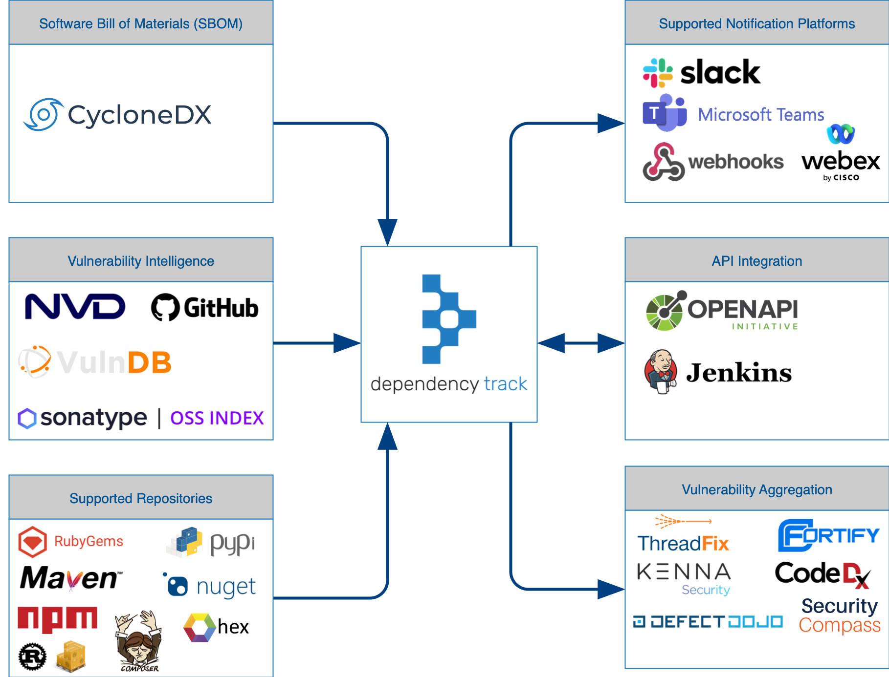
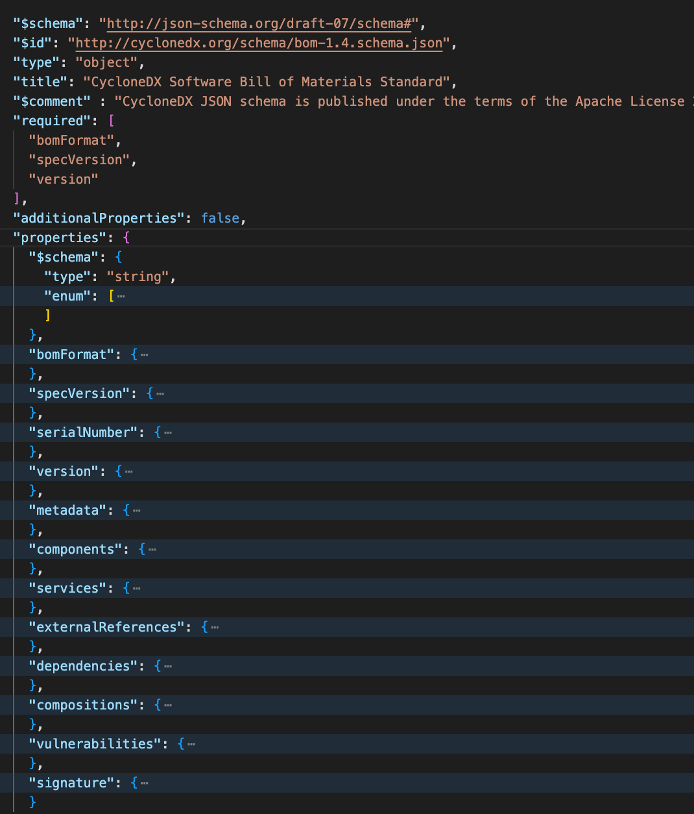

# Dependency Track 
## Integrations



## QuickStart Deployment

```bash
# Downloads the latest Docker Compose file
curl -LO https://dependencytrack.org/docker-compose.yml

# Starts the stack using Docker Compose in Detached mode: Run containers in the background
docker-compose up --detach
```

- [CI/CD](https://docs.dependencytrack.org/usage/cicd/)


## Continuous Integration & Delivery

### CycloneDX

To publish CycloneDX BOMs, use a valid API Key and project UUID. Finally, Base64 encode the BOM and insert the resulting text into the ‘bom’ field.

```bash
curl -X "PUT" "http://dtrack.example.com/api/v1/bom" \
     -H 'Content-Type: application/json' \
     -H 'X-API-Key: XXXXXXXXXXX' \
     -d $'{
  "project": "f90934f5-cb88-47ce-81cb-db06fc67d4b4",
  "bom": "PD94bWwgdm..."
  }'
```

It’s also possible to publish BOMs via HTTP POST which does not require Base64 encoding the payload.

```bash
curl -X "POST" "http://dtrack.example.com/api/v1/bom" \
     -H 'Content-Type: multipart/form-data' \
     -H 'X-Api-Key: XXXXXXXXXXX' \
     -F "project=f90934f5-cb88-47ce-81cb-db06fc67d4b4" \
     -F "bom=<?xml version=\"1.0\" encoding=\"UTF-8\"?>..."
```

### Large Payloads

In cases where the scan or BOM being uploaded is large, using cURL’s capability of specifying a file containing a payload may be preferred.

```bash
curl -X "PUT" "http://dtrack.example.com/api/v1/bom" \
     -H 'Content-Type: application/json' \
     -H 'X-API-Key: XXXXXXXXXXX' \
     -d @payload.json
```


## Impact Analysis

Dependency-Track contains a full mirror for each of the vulnerability datasources it supports. Virtually all public information about the vulnerability including the description, affected versions, CWE, and severity, are captured, as well as the affected projects. The list of affected projects is dynamically generated based on data in Dependency-Track at the time of inquiry.


## Policy Compliance

[Read This](./Docs/Policy%20Compliance.md)

## Software Bill Of Materials

[Read This](./Docs/Software%20Bill%20of%20Materials.md)



## Known Vulnerability Analysis

[Read This](./Docs/Known%20Vulnerability%20Analysis.md)

## Outdated Component Analysis

Dependency-Track relies on integration with repositories to help identify metadata that may be useful for the identification of risk. Package repositories to manage and automatically resolve dependencies.

Dependency-Track incorporates the concept of repositories, completely independent of software engineering use-cases, as a way to gain additional intelligence about the components it’s tracking. Dependency-Track brings the power of package repositories to every project the system tracks, whether the project is developed internally or commercial off-the-shelf software.

https://docs.dependencytrack.org/datasources/repositories/


## Analysis State

| State          | Description                                                                                                                    |
|----------------|--------------------------------------------------------------------------------------------------------------------------------|
| EXPLOITABLE    | The finding is exploitable (or likely exploitable)                                                                             |
| IN_TRIAGE      | An investigation is in progress to determine if the finding is accurate and affects the project or component                   |
| FALSE_POSITIVE | The finding was identified through faulty logic or data (i.e. misidentified component or incorrect vulnerability intelligence) |
| NOT_AFFECTED   | The finding is a true positive, but the project is not affected by the vulnerability identified                                |
| NOT_SET        | Analysis of the finding has not commenced                                                                                      |


## DefectDojo Integration

[Read This](./Docs/DefectDojo%20Integration.md)

## Best Practices

[Read This](./Docs/Best%20Practices.md)

## To Read

- [ ] https://docs.dependencytrack.org/integrations/notifications/
- [ ] https://docs.dependencytrack.org/integrations/rest-api/
- [ ] https://docs.dependencytrack.org/integrations/badges/


## FAQs

- https://docs.dependencytrack.org/FAQ/
- [Terminology](./Docs/Terminology.md)


## Note 

These are verbatim notes from https://docs.dependencytrack.org. Please visit the original documentation for more up-to date definitions.